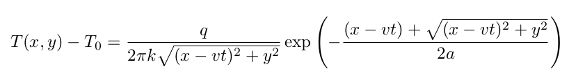
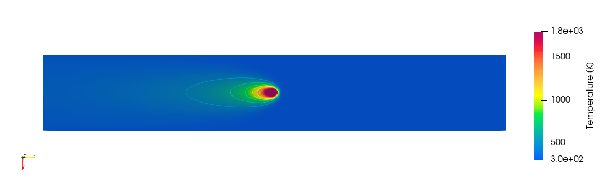
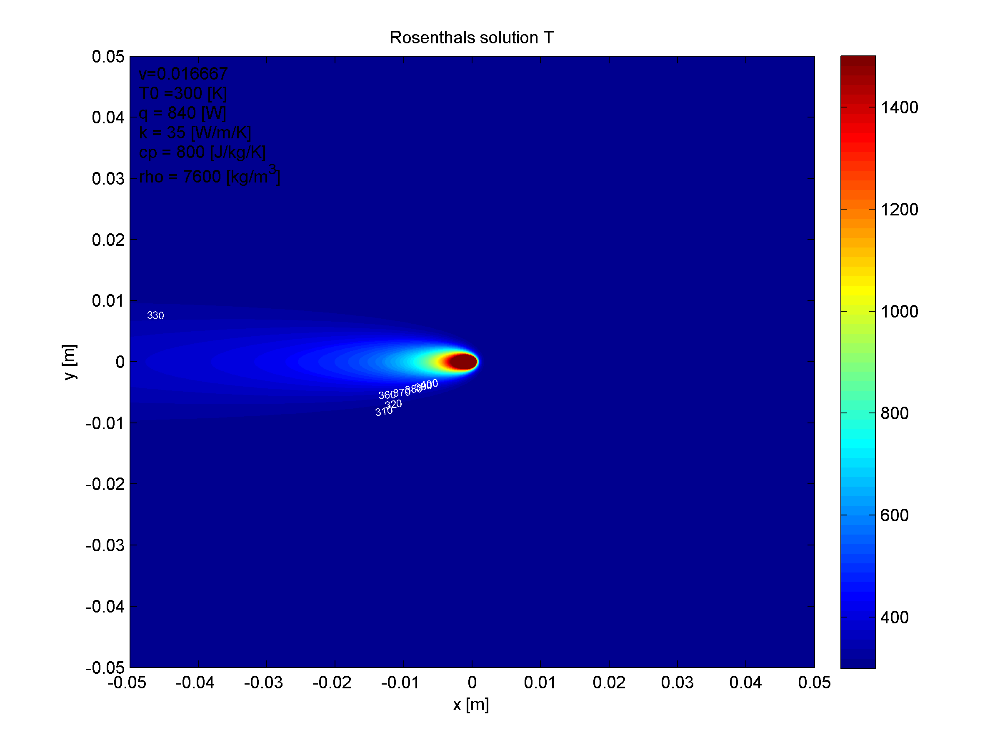

# Introduction

Analytical solution for a moving heat source points can be written in the following form:



In this reposiroty, a Matlab code and a C++ code (using VTK) are provided to calculate and plot the temperature field for given material parameters; as illustrated in the figures below:




# Compile C++ code

> note: requires VTK

```
mkdir build && cd build
cmake ..
make
```

Executable will be created in `\bin` and will generate a `.vtk` file in the same directory. 
